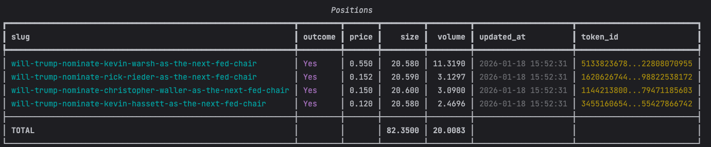

# poly-position-watcher


[English](README.md) | [中文](README.zh.md)

## Overview

`poly-position-watcher` focuses on real-time position and order monitoring:

- WSS real-time tracking for `TRADE` and `ORDER` (positions + orders)
- HTTP polling fallback for reliability
- Optional fee calculation (toggle + custom formula)
- Two sizes exposed: `size` for CLOB matched trades, `sellable_size` for on-chain confirmed trades
- Failed trades are detected and returned on positions (`has_failed`, `failed_trades`)

**Note: WSS disconnects are auto-detected and reconnected.**

## Installation

```bash
pip install poly-position-watcher
# pip install poly-position-watcher --index-url https://pypi.org/simple
```

If installing from source, clone this repo and run `pip install -e .`.

## Quick start

```python
from py_clob_client.client import ClobClient
from poly_position_watcher import PositionWatcherService, OrderMessage, UserPosition

client = ClobClient(
    base_url="https://clob.polymarket.com",
    key="<wallet-key>",
    secret="<wallet-secret>",
)

with PositionWatcherService(
    client=client,
    init_positions=True,  # Initialize positions via official API
    enable_http_fallback=True,  # Enable HTTP polling fallback
    add_init_positions_to_http=True,  # Auto-add condition_ids from init positions to HTTP monitoring
    enable_fee_calc=True,  # Optional: enable fee adjustments
    # fee_calc_fn=custom_fee_fn,  # Optional: override fee formula
) as service:
    # Non-blocking: Get current positions and orders (returns immediately)
    position: UserPosition = service.get_position("<token_id>")
    order: OrderMessage = service.get_order("<order_id>")
    print(position)
    print(order)
    service.show_positions(limit=10)
    service.show_orders(limit=10)
    
    # Blocking: Wait for position/order updates (with timeout)
    position: UserPosition = service.blocking_get_position("<token_id>", timeout=5)
    order: OrderMessage = service.blocking_get_order("<order_id>", timeout=3)
    print(position)
    print(order)
    
    # Optional: If you open new positions/orders and want to monitor them via HTTP fallback
    # service.add_http_listen(market_ids=["<condition_id>"], order_ids=["<order_id>"])
    # service.remove_http_listen(market_ids=["<condition_id>"], order_ids=["<order_id>"])
    # service.clear_http()  # Clear all monitoring items, threads continue running
```


Example output:

```shell
OrderMessage(
  type: 'update',
  event_type: 'order',
  asset_id: '7718951783559279583290056782453440...',
  associate_trades: ['8bf02a75-5...'],
  id: '0x74a71abb9efe59c994e0...',
  market: '0x3b7e9926575eb7fae2...',
  order_owner: None,
  original_size: 37.5,
  outcome: 'Up',
  owner: '',
  price: 0.52,
  side: 'BUY',
  size_matched: 37.5,
  timestamp: 0.0,
  filled: True,
  status: 'MATCHED',
  created_at: datetime.datetime(2025, 12, 8, 9, 44, 50, tzinfo=TzInfo(0))
)
UserPosition(
  price: 0.0,
  size: 0.0,
  volume: 0.0,
  sellable_size: 0.0,
  token_id: '',
  last_update: 0.0,
  market_id: None,
  outcome: None,
  created_at: None,
  has_failed: False,
  failed_trades: []
)
```


**Full example (`examples/example.py`)**

## Pretty printing

```python
service.show_positions(limit=10)
service.show_orders(limit=10)
```



## **⚠️ Fee notice (taker fee / maker rebate)**
---

Some Polymarket markets enable taker fee / maker rebate. This library **fully supports fee calculation** and lets you control it:

- Enable with `enable_fee_calc=True` to apply fees using `feeRateBps` from trades/orders
- Customize with `fee_calc_fn` if you need a different formula
- Disable (default) if you prefer pre-fee positions

Default fee formula (when `fee_calc_fn` is not provided):
`fee = 0.25 * (p * (1 - p)) ** 2 * (fee_rate_bps / 1000)`, and `new_size = (1 - fee) * size`.

---

## Position Initialization

When `init_positions=True`, the service will:
- Fetch current positions via the official Polymarket API (`/positions`)
- Create fake trades from position data to maintain compatibility with existing trade-based calculations
- Skip positions with `currentValue = 0` (empty positions)
- Optionally add condition IDs to HTTP monitoring if `add_init_positions_to_http=True`

The HTTP fallback polling threads run persistently throughout the `with` statement lifecycle. You can dynamically add/remove markets and orders without restarting threads.

> Note: If you start the watcher before any positions exist, set `init_positions=False`. The HTTP fallback can be enabled independently and will start with empty monitoring sets if needed.

## Configuration

### Service Parameters

| Parameter | Type | Default | Description |
| --- | --- | --- | --- |
| `init_positions` | bool | False | Initialize positions via official Polymarket API on startup |
| `enable_http_fallback` | bool | False | Enable persistent HTTP polling threads as WebSocket fallback |
| `http_poll_interval` | float | 3.0 | HTTP polling interval in seconds |
| `add_init_positions_to_http` | bool | False | Automatically add condition IDs from initialized positions to HTTP monitoring |
| `enable_fee_calc` | bool | False | Apply fee adjustments using `feeRateBps` from trades/orders |
| `fee_calc_fn` | callable | None | Custom fee function: `(size, price, fee_rate_bps) -> new_size` |

### Environment Variables

| Environment variable | Description |
| --- | --- |
| `poly_position_watcher_LOG_LEVEL` | Log level, default `INFO` |

To set a proxy for WebSocket connections, build a dict before creating `PositionWatcherService` and pass it as `wss_proxies`:

```python
PROXY = {"http_proxy_host": "127.0.0.1", "http_proxy_port": 7890}
service = PositionWatcherService(client, wss_proxies=PROXY)
```

## Dependencies

- [`py-clob-client`](https://github.com/Polymarket/py-clob-client)
- [`pydantic`](https://docs.pydantic.dev/)
- [`websocket-client`](https://github.com/websocket-client/websocket-client)
- [`requests`](https://requests.readthedocs.io/en/latest/)

## Layout

```
poly_position_watcher/
├── api_worker.py          # HTTP backfill and context management
├── position_service.py    # Core entry; maintains position/order caches
├── trade_calculator.py    # Position calculation utils
├── wss_worker.py          # WebSocket client implementation
├── common/                # Logging and enums
└── schema/                # Pydantic models
```

## License

MIT
