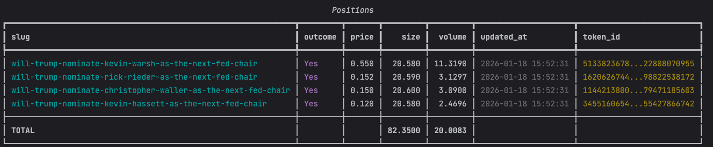

# poly-position-watcher

## 概览

`poly-position-watcher` 专注实时仓位与订单监控：

- WSS 实时追踪 `TRADE` 与 `ORDER`（仓位 + 订单）
- HTTP 轮询兜底，保证可用性
- 可选手续费计算，直接使用 market `feeSchedule`
- 用于成交判断的仓位字段：
  `size`（扣手续费后净仓位）、`original_size`（扣手续费前净仓位）、`sellable_size`（链上 CONFIRMED 可卖出仓位）、`fee_amount`（累计手续费金额）
- 识别失败交易，并在仓位结果中返回失败交易列表

**说明：WSS 断线会自动检测并重连。**

## 安装

```bash
pip install poly-position-watcher
# pip install poly-position-watcher --index-url https://pypi.org/simple
```

如果你是从源码安装，先克隆本仓库然后执行 `pip install -e .`。

## 快速开始

```python
from py_clob_client.client import ClobClient
from poly_position_watcher import PositionWatcherService, OrderMessage, UserPosition

client = ClobClient(
    base_url="https://clob.polymarket.com",
    key="<wallet-key>",
    secret="<wallet-secret>",
)

with PositionWatcherService(
    client=client,
    init_positions=True,  # 通过官方 API 初始化仓位
    enable_http_fallback=True,  # 启用 HTTP 兜底轮询
    add_init_positions_to_http=True,  # 自动将初始化仓位的 condition_id 加入 HTTP 监控
    enable_fee_calc=True,  # 可选：启用手续费计算
) as service:
    service.set_market_fee_schedule(
        "<condition_id>",
        {"rate": 0.0175, "exponent": 1, "takerOnly": True, "rebateRate": 0.25},
    )

    # 非阻塞：获取当前仓位和订单（立即返回）
    position: UserPosition = service.get_position("<token_id>")
    strategy_position: UserPosition | None = service.get_position_by_order_ids(["<order_id>"])
    strategy_positions: dict[str, UserPosition] = service.get_positions_by_order_ids(
        ["<order_id_1>", "<order_id_2>"]
    )
    order: OrderMessage = service.get_order("<order_id>")
    print(position)
    print(strategy_position)
    print(strategy_positions)
    print(order)
    if position:
        print("size(扣费后):", position.size)
        print("size(扣费前):", position.original_size)
        print("fee_amount:", position.fee_amount)
    service.show_positions(limit=10)
    service.show_orders(limit=10)
    
    # 阻塞：等待仓位/订单更新（带超时）
    position: UserPosition = service.blocking_get_position("<token_id>", timeout=5)
    order: OrderMessage = service.blocking_get_order("<order_id>", timeout=3)
    print(position)
    print(order)
    
    # 可选：如果你新开了仓位/订单，需要通过 HTTP 兜底监控它们时，可以使用以下 API
    # service.add_http_listen(market_ids=["<condition_id>"], order_ids=["<order_id>"])
    # service.set_http_listen(
    #     market_ids=["<condition_id>"],
    #     order_ids=["<order_id>"],
    #     group="strategy-a",
    # )
    # service.clear_http(group="strategy-a")
    # service.remove_http_listen(market_ids=["<condition_id>"], order_ids=["<order_id>"])
    # service.clear_http()  # 清空所有监控项，但线程继续运行
```

重要提示：
- 当 `enable_fee_calc=True` 时，需要显式通过 `set_market_fee_schedule(...)` 或 `set_market_fee_schedules(...)` 注册 market 的 fee metadata。
- `get_position()` 不会自动查询 `/markets`。
- 如果你需要按策略 / order ids 维度拿仓位，可以用 `get_position_by_order_ids(...)` 或 `get_positions_by_order_ids(...)`；实现上会先走 `order.associate_trades`，再回退到 watcher 内部根据实时 trade 建的 order-trade 索引。
- 如果多个调用方共用一个 watcher，可以给 `add_http_listen(...)`、`remove_http_listen(...)`、`set_http_listen(...)`、`set_market_http_listen(...)`、`set_order_http_listen(...)`、`clear_http(...)` 传 `group="..."`，按命名空间隔离各自的 HTTP 兜底监听集合。
- 如果某个 market 没有注册 `feeSchedule`，该 market 的手续费会先跳过，并打印一次 warning。

`feeSchedule` 从哪里取：
- 先调用 Gamma API 的 event 或 market 查询接口，再从返回的 market 对象里读取 `feeSchedule`。
- trade 数据里的 `trade.market` 就是 market 的 `conditionId`，所以注册时应使用 `conditionId -> feeSchedule`。
- 官方文档：
  [Fees](https://docs.polymarket.com/trading/fees)，
  [Get event by id](https://docs.polymarket.com/api-reference/events/get-event-by-id)，
  [List markets](https://docs.polymarket.com/api-reference/markets/list-markets)，
  [Get market by slug](https://docs.polymarket.com/api-reference/markets/get-market-by-slug)

示例：通过 event 接口一次性注册事件下所有 market 的手续费元数据

```python
import requests

event = requests.get(
    "https://gamma-api.polymarket.com/events/<event_id>",
    timeout=10,
).json()

fee_schedule_map = {
    market["conditionId"]: market.get("feeSchedule")
    for market in event.get("markets", [])
    if market.get("feeSchedule")
}

service.set_market_fee_schedules(fee_schedule_map)
```

示例：通过单个 market 接口注册 feeSchedule

```python
import requests

market = requests.get(
    "https://gamma-api.polymarket.com/markets/slug/<market-slug>",
    timeout=10,
).json()

service.set_market_fee_schedule(
    market["conditionId"],
    market.get("feeSchedule"),
)
```


示例输出：

```shell
OrderMessage(
  type: 'update',
  event_type: 'order',
  asset_id: '7718951783559279583290056782453440...',
  associate_trades: ['8bf02a75-5...'],
  id: '0x74a71abb9efe59c994e0...',
  market: '0x3b7e9926575eb7fae2...',
  order_owner: None,
  original_size: 37.5,
  outcome: 'Up',
  owner: '',
  price: 0.52,
  side: 'BUY',
  size_matched: 37.5,
  timestamp: 0.0,
  filled: True,
  status: 'MATCHED',
  created_at: datetime.datetime(2025, 12, 8, 9, 44, 50, tzinfo=TzInfo(0))
)
UserPosition(
  price: 0.0,
  size: 0.0,
  original_size: 0.0,
  volume: 0.0,
  fee_amount: 0.0,
  sellable_size: 0.0,
  token_id: '',
  last_update: 0.0,
  market_id: None,
  outcome: None,
  created_at: None,
  has_failed: False,
  failed_trades: []
)
```

**完整示例（`examples/example.py`）**

## 友好打印

```python
service.show_positions(limit=10)
service.show_orders(limit=10)
```



## ⚠️ **手续费（Fee / Taker Fee）注意事项**
Polymarket 在部分市场启用 taker fee / maker rebate。本库支持直接基于 market `feeSchedule` 计算手续费：

- 通过 `enable_fee_calc=True` 开启
- 通过 `service.set_market_fee_schedule(...)` 或 `service.set_market_fee_schedules(...)` 注册 `condition_id -> feeSchedule`
- 如果你希望仓位结果包含手续费影响，这一步是必须的；watcher 不会自动去查 `/markets`
- 实际接入时，直接从 Gamma 的 market/event 返回结果里取 `market.get("feeSchedule")`
- 通过 `fee_calc_fn` 自定义手续费处理
- 不开启（默认）则按 pre-fee 方式计算
- 返回仓位字段语义：
  `size` = 扣手续费后净仓位，`original_size` = 扣手续费前净仓位，`fee_amount` = 累计手续费金额

默认手续费公式（未传 `fee_calc_fn` 时）：
`fee = size * rate * price * (1 - price)`。

其中 taker buy 以 shares 扣费，所以会减少 `size`；taker sell 以 USDC 扣费，所以不改仓位数量，只累加 `fee_amount`。

---

## 仓位初始化

当 `init_positions=True` 时，服务会：
- 通过官方 Polymarket API (`/positions`) 获取当前仓位
- 从仓位数据创建假交易以保持与现有基于交易的计算逻辑兼容
- 跳过 `currentValue = 0` 的仓位（空仓位）
- 如果 `add_init_positions_to_http=True`，可选择性地将 condition ID 添加到 HTTP 监控中

HTTP 兜底轮询线程在整个 `with` 语句生命周期内持续运行。可以动态添加/移除市场和订单，无需重启线程。

> ⚠️ 注意：如果你在仓位产生之前启动监控器，设置 `init_positions=False`。HTTP 兜底可以独立启用，如果需要，将以空的监控集合启动。

## 配置

### 服务参数

| 参数 | 类型 | 默认值 | 说明 |
| --- | --- | --- | --- |
| `init_positions` | bool | False | 启动时通过官方 Polymarket API 初始化仓位 |
| `enable_http_fallback` | bool | False | 启用持久化 HTTP 轮询线程作为 WebSocket 兜底 |
| `http_poll_interval` | float | 3.0 | HTTP 轮询间隔（秒） |
| `add_init_positions_to_http` | bool | False | 自动将初始化仓位的 condition ID 添加到 HTTP 监控中 |
| `enable_fee_calc` | bool | False | 使用已注册的 market `feeSchedule` 进行手续费调整 |
| `market_fee_schedules` | mapping | None | 可选，初始化传入 `condition_id -> feeSchedule` 映射 |
| `fee_calc_fn` | callable | None | 自定义手续费函数：`(size, price, side, fee_schedule) -> (new_size, fee_amount)` |

### 环境变量

| 环境变量 | 说明 |
| --- | --- |
| `poly_position_watcher_LOG_LEVEL` | 调整日志级别，默认为 `INFO` |

若需要为 WebSocket 连接设置代理，可在实例化 `PositionWatcherService` 前自行构造一个字典并通过 `wss_proxies` 传入，例如：

```python
PROXY = {"http_proxy_host": "127.0.0.1", "http_proxy_port": 7890}
service = PositionWatcherService(client, wss_proxies=PROXY)
```

## 依赖

- [`py-clob-client`](https://github.com/Polymarket/py-clob-client)
- [`pydantic`](https://docs.pydantic.dev/)
- [`websocket-client`](https://github.com/websocket-client/websocket-client)
- [`requests`](https://requests.readthedocs.io/en/latest/)

## 目录结构

```
poly_position_watcher/
├── api_worker.py          # HTTP 补数与上下文管理
├── position_service.py    # 核心入口，维护仓位/订单缓存
├── trade_calculator.py    # 仓位计算工具
├── wss_worker.py          # WebSocket 客户端实现
├── common/                # 日志与枚举
└── schema/                # Pydantic 数据模型
```

## 许可证

MIT
